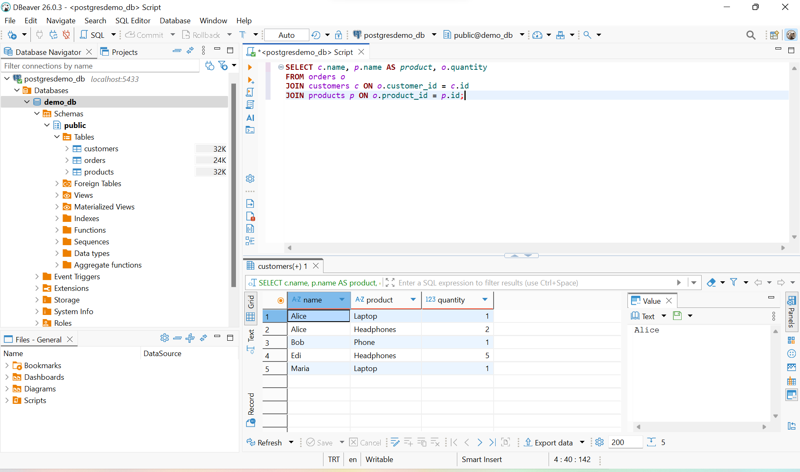

#  DBeaver Tool Presentation

## 1. What is this tool?

DBeaver is an open-source universal database management tool that supports multiple database systems such as PostgreSQL, MySQL, and others. It provides a graphical interface for database administration, SQL querying, and data visualization. Compared to command-line tools, DBeaver simplifies working with databases through an intuitive UI.

---

## 2. Prerequisites

Make sure the following are installed:

- Docker  
- Docker Compose  
- DBeaver  
- Git  

---

## 3. Installation

Clone the repository and start the PostgreSQL container:

```bash
git clone https://github.com/itu-itis23-leka23/dbeaver-tool-presentation.git
cd dbeaver-tool-presentation
docker compose up -d
```

This will:
- Start a PostgreSQL container  
- Automatically create and initialize the database using `init.sql`  

---

## 4. Running the Example

### Step 1 – Open DBeaver

- Launch DBeaver  
- Click **New Database Connection → PostgreSQL**

---

### Step 2 – Configure Connection

Use the following settings:

- Host: `localhost`  
- Port: `5433`  
- Database: `demo_db`  
- Username: `postgres`  
- Password: `pass`  
(Only if you didnt change the original configuration)
Click **Test Connection → Finish**

---

### Step 3 – Run SQL Query

Open SQL Editor and run:

```sql
SELECT c.name, p.name AS product, o.quantity
FROM orders o
JOIN customers c ON o.customer_id = c.id
JOIN products p ON o.product_id = p.id;
```

---

## 5. Expected Output

The query should return a table showing:

- Customer names  
- Purchased products  
- Quantities  

Example output:

| name  | product     | quantity |
|------|------------|---------|
| Alice | Laptop     | 1       |
| Alice | Headphones | 2       |
| Bob   | Phone      | 1       |
| Edi   | Headphones | 5       |
| Maria | Laptop     | 1       |

### Screenshot


---

## 6. AI Usage Disclosure

AI tools such as Gemini and ChatGPT were used to assist with debugging Docker configuration.
